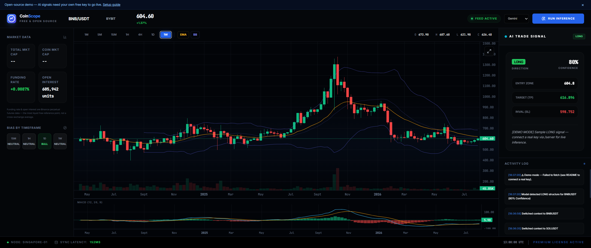

# CoinScope

An open-source crypto terminal — live charts, real market data, and an optional AI read, all in plain HTML/CSS/JS. No build step, no framework, no paid data.


*(this screenshot is from an earlier version of the UI — swap it for a fresh one once you've got it running)*

Fork it, gut it, make it yours. If this saves you a weekend of setup, a ⭐ on the repo helps other people building crypto tools find it too.

## What's in it

- **Live charts** — candles, EMA/Bollinger Band overlays, a synced MACD sub-panel. Powered by TradingView's Lightweight Charts.
- **4 exchanges** — Coinbase (default), Binance, KuCoin, Bybit. Switch anytime; if a coin isn't listed on the one you picked, you get a clear message instead of a silent failure.
- **10 coins** — BTC, ETH, SOL, BNB, XRP, DOGE, ADA, AVAX, LINK, TON.
- **7 timeframes** — 1M, 5M, 15M, 1H, 4H, 1D, 1W.
- **Market Data panel** — total crypto market cap, the selected coin's market cap, funding rate, and open interest, plus a Bull/Bear/Neutral read across four timeframes at once. All real numbers, no invented commentary.
- **AI Trade Signal panel** — pick a provider (Gemini, DeepSeek, Claude, or ChatGPT) and get a direction, entry, take-profit, stop-loss, and a one-line reasoning. Runs through a local proxy so no key ever touches the browser.
- **Responsive** — works down to a phone screen, not just desktop.

## Where the data actually comes from

Being upfront about this matters more than it sounds:

| Data | Source | Free? |
|---|---|---|
| Prices & candles | Coinbase / Binance / KuCoin / Bybit public APIs | Yes, no key |
| Total & per-coin market cap | CoinGecko public API | Yes, no key |
| Funding rate & Open Interest | Binance Futures public API | Yes, no key |
| AI signal | Whichever provider you pick | Gemini has a free tier; DeepSeek, Claude, and OpenAI require a funded account — that's normal for those providers, not something this project adds on top |

**Two honesty notes on the Market Data panel:**
- Funding rate and Open Interest are pulled from Binance's perpetual futures market specifically — they're the most liquid, freely available reference point for those two numbers, not a blended average across all exchanges.
- There's no reliable free public API for aggregate 24h liquidations across the market (that data exists, just behind paid providers like CoinGlass). Rather than fake a number, Open Interest is shown instead — it's the closest thing that's actually free and tells a similar story about how much leveraged exposure is sitting in the market.

## Project structure

```
├── index.html
├── style.css
├── utils.js
├── indicators.js       # RSI, MACD, EMA, SMA, Bollinger Bands, VWAP + plugin registry
├── market-data.js        # Market cap, funding rate, open interest, and the Bull/Bear/Neutral bias table
├── chart.js
├── api.js                 # Exchange adapters (Binance, Coinbase, KuCoin, Bybit) — add your own here
├── ai.js                    # Calls the local proxy, falls back to demo mode
├── ui.js
├── app.js
└── server/                   # Tiny proxy that keeps your AI provider keys off the browser
    ├── server.js
    ├── package.json
    └── .env.example
```

Scripts load in this order at the bottom of `index.html` — keep it this way, later files depend on globals set by earlier ones:

```html
<script src="utils.js"></script>
<script src="indicators.js"></script>
<script src="chart.js"></script>
<script src="api.js"></script>
<script src="ai.js"></script>
<script src="market-data.js"></script>
<script src="ui.js"></script>
<script src="app.js"></script>
```

## Setup

```bash
git clone https://github.com/yourusername/coinscope.git
cd coinscope
```

Open `index.html` — charts, exchange switching, coin switching, and the whole Market Data panel work immediately, no backend needed.

### To get live AI signals (instead of demo mode)

The AI panel works out of the box in **demo mode** — a clearly-labeled sample signal so the UI isn't empty. To get real signals:

1. Pick a provider and get a key:
   - **Gemini** (free tier): [aistudio.google.com/apikey](https://aistudio.google.com/apikey)
   - **DeepSeek**: [platform.deepseek.com/api_keys](https://platform.deepseek.com/api_keys)
   - **Claude**: [console.anthropic.com/settings/keys](https://console.anthropic.com/settings/keys)
   - **ChatGPT**: [platform.openai.com/api-keys](https://platform.openai.com/api-keys)

   You only need one — set up whichever you'll actually pick from the dropdown.

2. ```bash
   cd server
   npm install
   cp .env.example .env
   # paste your key(s) into .env
   npm start
   ```
3. Reload `index.html`, pick your provider from the dropdown next to **Run Inference**, and click it.

Your keys never leave your machine and are never committed — `.env` is in `.gitignore`. Only the *provider name* you pick (e.g. `"gemini"`) is sent from the browser to the proxy; the actual key is looked up server-side.

## Customizing

- **Colors** — CSS variables at the top of `style.css`.
- **Coins / exchanges** — edit the dropdown lists in `index.html`, and the matching `symbolMap` entries in `api.js`.
- **Indicators** — add your own in `indicators.js` via `Indicators.register('Name', fn)`.
- **Exchanges** — add your own in `api.js` via `Exchanges.register('name', adapter)`.
- **Bias scoring / market data sources** — all in `market-data.js`.
- **AI providers** — add one in `server/server.js`: write a `callYourProvider(prompt)` function following the existing four as a template, then add it to the `PROVIDERS` object.

## Contributing

This stays small on purpose — the whole point is you can read every file in one sitting. Good first contributions:

- **Add an indicator** — one pure function in `indicators.js`, registered with `Indicators.register(...)`.
- **Add an exchange** — implement `ticker()` and `candles()` in `api.js`, following any of the four existing adapters as a template.
- **Add an AI provider** — one function in `server/server.js` following the same pattern as the other four.

Open a PR — no CLA, no build step to fight.

## Disclaimer

This is a dev tool, not financial advice. Nothing here — market data, bias table, or AI signals — is a recommendation to trade. Do your own research.
